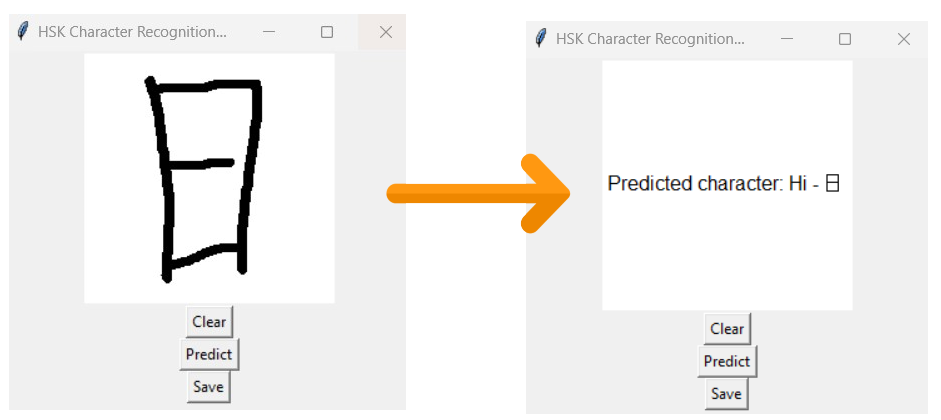

# HSK_AI🧧

TensorFlow-based HSK1 Chinese Character Recognition: A machine learning project for accurate identification and classification of basic Chinese characters.

The database of HSK1 Chinese characters from Artem BORZENKO was used for the creation of the model, here is a link to it: https://www.kaggle.com/code/artemborzenko/chinese-characters-hsk-1-level-recognition

	

## Technologies

- Python
- Tensorflow
- Tkinter

## Credits

- [**Alexandre BOURDOIS**](https://github.com/alexandre-bourdois) : Creator of the project.
